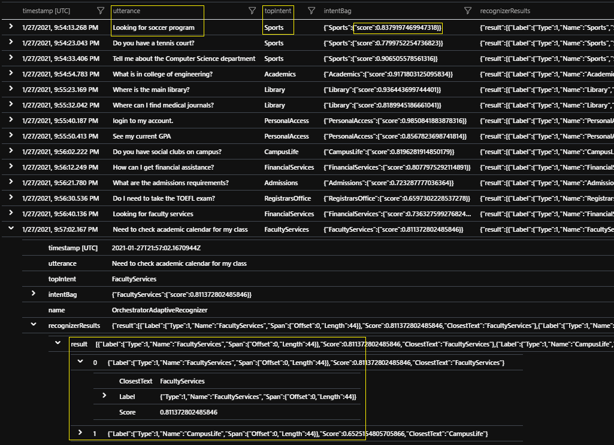
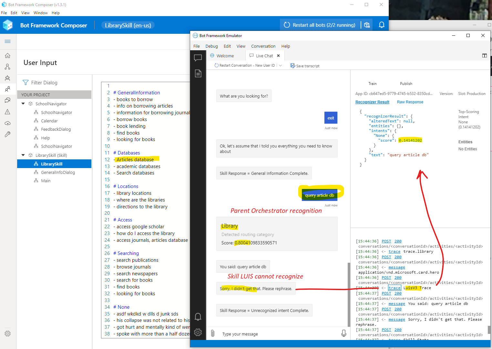

# School skill navigator bot

This example shows from end-to-end how to use bf orchestrator commandlets to improve the quality of a training set ( in [.lu format](https://docs.microsoft.com/en-us/azure/bot-service/file-format/bot-builder-lu-file-format?view=azure-bot-service-4.0)), and how to use [Composer](https://docs.microsoft.com/en-us/composer/introduction) to build a bot from examples in [.lu format](https://docs.microsoft.com/en-us/azure/bot-service/file-format/bot-builder-lu-file-format?view=azure-bot-service-4.0). 

This example can be split into two parts: [the first part](#part-1:-evaluate-and-improve-the-quality-of-the-training-set) takes a training set (in [.lu format](https://docs.microsoft.com/en-us/azure/bot-service/file-format/bot-builder-lu-file-format?view=azure-bot-service-4.0)) and a test set (in [.lu format](https://docs.microsoft.com/en-us/azure/bot-service/file-format/bot-builder-lu-file-format?view=azure-bot-service-4.0)) as input, and the output is a revised training set that performs more accurately. You can skip this part if you don't have a test set. The [second part](#part-2:-use-composer-to-build-a-bot-from-a-training-file) takes a training set in [.lu format](https://docs.microsoft.com/en-us/azure/bot-service/file-format/bot-builder-lu-file-format?view=azure-bot-service-4.0) (either the original file, or the revised one from Part 1) as input, and outputs a bot by using [Composer](https://docs.microsoft.com/en-us/composer/introduction).

## Prerequisites

This sample **requires** prerequisites in order to run.

- Install BF CLI with Orchestrator plugin

  - Install bf cli 

  ```bash
  > npm i -g @microsoft/botframework-cli
  ```

  - Install bf orchestrator

  ```bash
  > bf plugins:install @microsoft/bf-orchestrator-cli@beta
  ```

    If you have previously installed bf orchestrator plugin, uninstall that version and then run the install command again.
    Uninstall command:

  ```bash
  > bf plugins:uninstall @microsoft/bf-orchestrator-cli
  ```

  - Make sure bf orchestrator command is working and shows all available orchestrator commands

  ```bash
  > bf orchestrator
  ```

## To try this bot sample

- Clone the repository

  ```bash
  > git clone https://github.com/microsoft/botbuilder-samples.git
  ```

- CD experimental/orchestrator/Composer/01.school-skill-navigator

  ```bash
  > cd experimental/orchestrator/Composer/01.school-skill-navigator
  ```
  
- Download Orchestrator base model
 ```bash
  > mkdir model
  > bf orchestrator:basemodel:get --out ./model
 ```

## Part 1: Evaluate and improve the quality of the training set

To statistically evaluate the performance of a training set, we need a test set. If you do not have a test set, please skip to [Part 2](#part-2:-use-composer-to-build-a-bot-from-a-training-file). To explain the example, we have two files attached in this folder: a training file [schoolnavigatorbot.train.lu](schoolnavigatorbot.train.lu) to build the language model, and a test file [schoolnavigatorbot.test.lu](schoolnavigatorbot.test.lu) to evaluate the accuracy of the language model. Note that for proper evaluation the utterances in the test file should not be included in the training file.

### Evaluation

- First, we generate the language model from the training file:


```
> bf orchestrator:create -m model -i schoolnavigatorbot.train.lu -o .
```

The snapshot of the language model file should be written to schoolnavigatorbot.train.blu

- Then we evaluate the performance of the generated language model by using:

```
> bf orchestrator:test -m model -i schoolnavigatorbot.train.blu -t schoolnavigatorbot.test.lu -o report
```

Evaluation reports should be written to folder [report](report). Detail report interpretation can be found [here](https://github.com/microsoft/botframework-sdk/blob/main/Orchestrator/docs/BFOrchestratorReport.md).

- Open **report/orchestrator_testing_set_summary.html** through a browser, and navigate to the **Average confusion matrix metrics** section from the last page **Metrics**, you will find the recommended evaluation metric: **Micro-Average Accuracy** = 0.9869.

### Improve

Accuracy 0.9869 is high but not perfect yet (note that in most real-life case one should not expect 100% accuracy ). To improve the quality of the training set, we could benefit from the **Misclassified** information from the evaluation report. In this page, all mislabeled query utterances from the test set are listed. **Labels** refer to the ground-truth labels, and **predictions** refer to the model predictions. In our example, there are 2 mislabeled utterances, we will use them to illustrate the improving process here.

Next we are going to use the two mis-classified query utterances to show how to improve the training set. 

- The first utterance "where are the tennis courts" should be labeled as Sports, but is mis-labeled as StudentServices. Closest Example shows the closest evidence example from that category, and Score shows the similarity between the query utterance and Closest Example. Taking a closer look into the examples, "where are the Recreation facilities" and "where's the gym" are essentially referring to the same thing, but separated into different labels, which eventually confused the model. To clarify the concepts, we could **manually relabel the utterance "where are the Recreation facilities" by moving it  from # StudentServices to # Sports in schoolnavigatorbot.train.lu.** 

- The second utterance "where is the Healthcare Management school" should be labeled as Academics, but is mis-labeled as StudentServices. To correct the query prediction, we could **manually add a close example ("where can I find Healthcare Management") to # Academics in schoolnavigatorbot.train.lu.**

- After fixing the two query utterances, we could try the evaluation process again to check the progress:

  ```
  > bf orchestrator:create -m model -i schoolnavigatorbot.train.lu -o .
  > bf orchestrator:test -m model -i schoolnavigatorbot.train.blu -t schoolnavigatorbot.test.lu -o report
  ```

- Open **report/orchestrator_testing_set_summary.html** again, and check the **Micro-Average** under **Metrics** page, the accuracy has improved from 0.9869 to 1, and the two query utterances no longer show up in misclassified page.

- In practice, users could repeat the aforementioned procedures until they are satisfied with accuracy, refined as (1) using Misclassified page to check for mis-labeled utterances; (2) editing .lu file to add or relabel utterances; (3) using bf orchestrator:create to regenerate the language model; and (4) using bf orchestrator:test to evaluate the performance.

- Advanced users could also use bf orchestrator:interactive to interactively add/change/remove example utterances to improve the training set. Further information please refer to [bf orchestrator interactive](https://github.com/microsoft/botframework-sdk/blob/main/Orchestrator/docs/BFOrchestratorInteractive.md#start-an-interactive-session-with-a-training-set). 


## Part 2: Use Composer to build a bot from a training set (.lu file)

If you used a test file or have modified the .LU file such that the report show satisfactory language recognition, replace the contents of the corresponding file [schoolnavigatorbot.en-us.lu](./SchoolNavigatorBot/language-understanding/en-us/schoolnavigatorbot.en-us.lu)  in the Composer solution (either overwrite the file or copy/paste the contents inside Composer LU corresponding to the SchoolNavigator dialog). 

Build and run Composer project and test that language recognition is satisfactory such as by interacting with your bot using Bot Framework Emulator.

This process shall be repeated periodically as new utterances are discovered as users interact with the bot (see next section).


## Part 3: Language Recognition Tuning with Application Insights

Language development cycle is an iterative process. Once the bot is deployed and users interact with the bot, new utterances may not be detected correctly. Use Application Insights to inspect how Orchestrator Recognizer maps utterances intent labels. Once incorrect mappings are discovered repeat the tuning process above and redeploy.

Refer to the following documentation to configure Composer to [capture your bot's telemetry data](https://docs.microsoft.com/en-us/composer/how-to-capture-telemetry).

Analyzing Orchestrator telemetry is the similar to any recognizer's data (it is using the same base class for instrumentation).  

### Example

The following query illustrates how to retrieve specific range of utterances:

```
let queryStartDate = ago(2h);
let queryEndDate = now();
customEvents
| where timestamp > queryStartDate
| where timestamp < queryEndDate
| where name == 'OrchestratorAdaptiveRecognizer'
| extend utterance = customDimensions['Text']
| extend topIntent = customDimensions['TopIntent']
| extend intentBag = parse_json(customDimensions['Intents'])
| extend recognizerResults = parse_json(customDimensions['AdditionalProperties'])
| project timestamp, utterance, topIntent, intentBag, name, recognizerResults, customDimensions
```

Results contain:

* Original user utterance
* Detected top intent 
* Intent score
* Additional Results contain similar lower scoring intents.




## Part 4: Resolve Mixed Recognizers Conflicts

In case of mixed recognizers, where Orchestrator is used for example in root dialog for routing to a skill, and the skill recognizer uses LUIS for entity extraction, there may be a recognition disparity between Orchestrator and LUIS recognizers. This will lead to routing to the correct skill but the skill failing to handle the intent appropriately. 

Suppose an extension to this sample (not provided here) where School Navigator routes utterances to a Library skill. The skill uses LUIS for further handling. In this case, the following condition may arise:

- Utterance: “*query article db*”
- Both LU’s contain the example “*Articles database*”
- Parent School Navigator: Detects (Orchestrator score = 0.80) and routes utterance correctly to child skill.
- Child Library Skill :  Fails to recognize utterance (LUIS score = 0.14) and returns *unknown intent*.

The corrective action is for the child skill to improve its language handling by adding the failed utterance to their LU. The skill author has the best the chance to instrument, detect and correct unknown intents or handle them more gracefully whereas if the utterance was misrouted by parent, say to a QnAMaker or some other handler, corrective actions could be harder to detect, process or correct.

Illustration of scenario with Emulator trace:

 


